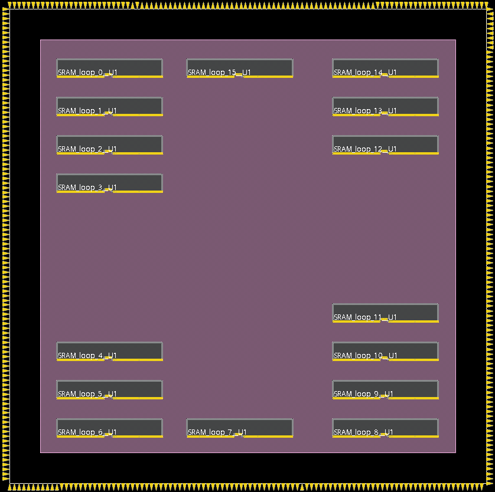
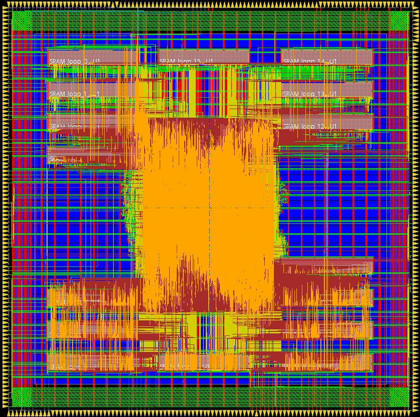

IC Lab Final Project Report
===

### Github link of the codes
Project Repository: [IC Lab 2021 Spring](https://github.com/sam29309010/2021_Spring_NCTU_ICLAB)

## Introduction
This project is the final report of course Integrated Circuit Design Laboratory (IC Lab). It is an implementation of simplified version time of flight (TOF), which is a distance measurement technique used in many applications, such as vehicle monitoring, object detection, robot navigation, etc. This project calculates the distance between sensor and object using given sensing signals, and also supports temporal/spatial adjustment to enhance the accuracy of estimation. For more information, refer to [time of flight introduction](https://en.wikipedia.org/wiki/Time_of_flight) and [project description](./Final_Project_2022S_V7.pdf).

## Design algorithm
Considering the constant noise and extra pulse probability of input signals, the distance could be estimated by identifying the bin location with highest value.
Four types of spatial correlation are supported, each of which follows specific temporal distribution for input signals. We realize 4 corresponding methods to predict the distance of given pattern pixelwise as follow.

1. None spatial correlation with *[0.3, 0.0, 0.3, 0.0, 0.3]* temporal pulse function

```
for each pixel:
    for each possible distance:
        calculate the bin summation across time dimension using pulse function as weights
        update the maximum summation and its corresponding distance
    return the distance with maximum summation
```

2. Group spatial correlation with *[0.3, 0.0, 0.3, 0.0, 0.3]* temporal pulse function
```
for each group:
    for each possible distance:
        calculate the bin summation across time dimension using pulse function as weights
        update the maximum summation and its corresponding distance
for each pixel:
    return the distance using the predicted peak and distance
```

3. Convex spatial correlation with *[0.1, 0.4, 0.3, 0.2, 0.1]* temporal pulse function
```
for each possible peak:
    for each possible distance:
        calculate the bin summation across time dimension using pulse function as weights
        update the maximum summation and its corresponding distance
    update the maximum summation and its corresponding peak & distance
for each pixel:
    return the distance using the predicted peak and distance
```

4. Concave spatial correlation with *[0.1, 0.4, 0.3, 0.2, 0.1]* temporal pulse function
```
The algorithm is similar with convex spatial correlation one.
```

## Top-level block diagram
The hardware implementation is composed of 3 main blocks
1. State controller controls the hardware workflow signals. It is composed of 3 FSM, one for main controller, one responsible for AXI4 signals, and one for distance calculation.
2. 16 SRAM memory blocks store the bin counting for each pixel.
3. Distance estimator calculates the most possible distance for each pixel

Overall, the hardware is controlled by 3 FSMs. It reads the histogram from DRAM ports or calculate it directly from input signals, depending on the value of *inputtype*, and then stores the result into SRAM memory. After that, estimator starts to work, accessing data in SRAM to predict the actual distance for each pixel.

## Implementation of distance estimator
Distance estimator is the hardware implementation of previous 4 algorithms. It is a 5-stage processor split by functionality and pipelined with 24 cycles.

**Temporal calc ==> Spatial calc ==> Distance pred ==> Peak pred ==> Shape pred**

The function for each stage is as follow:
1. Read in the bin information from SRAM in sequential order and calculate the summation of them pixelwise using pulse function as weights. (temporal-adjusted bins) 16 pixels are computed parallelly and is split by 5 cycles.
2. Calculate the summation of temporal-adjusted bins according to the type of spatial correlation. (spatial-adjusted bins). Since it requires to accumulate the bins at different distance for each assumed peak, a 16-cycle length buffer is supported. Also, 16 possible peaks are computed parallelly.
3. Update the maximum summation of spatial-adjusted bins and corresponding distance. (max-spatial-adjusted bins)
4. Update the maximum summation of max-spatial-adjusted bins and corresponding peak location & distance (only for convex and concave shape)
5. Update the one with greater 4th stage result (only for type3 uncertain shape)

## Implementation details
1. The input/output signals of SRAM should be at least 4 bits to store the maximum bin value 15. In this project, it is extended to 64 bits to fit the bit length of AXI burst signal. In this case the latency could be reduced since there's no need for DRAM signals to wait for SRAM data.
2. Multi-pipeline strategy is implemented. Since most time-consuming part is the calculation of peak prediction, it is divided away from the previous step to reduce the clock cycle. We also examine whether using IPs (vector adder) would enhance the performance, limited improvement is observed.
3. Resource sharing is exploited through the whole design, i.e., register sharing (e.g., the bin counting register and distance estimator-related register) and operator sharing (e.g. distance calculation at different condition)

    | Design | Period | Comb+Seq Area | Total Area (Synthesis) |
    | -------- | -------- | -------- | --------- |
    | Original | 20 | 582,618 | 2,007,850 |
    | + Register sharing | 20 | 530,766 | 1,954,664 |
    | + Operator sharing | 20 | 495,872 | 1,922,791 |

4. Performance-area pareto optimal
    | Clock cycle | Area | Synthesis Result |
    | ----------- | ---- | ---------------- |
    | 20  | 1,922,791 | Pass |
    | 10  | 1,928,735 | Pass |
    | 5.5 | 1,981,858 | Pass |
    | 5 | (2,013,948) | Violated |
5. Accuracy analysis
    The following table is the accuracy analysis from 32+1000(type0+type1/2/3) samples.
    | inputtype signal | Count | Correct | Accuracy | Average Error |
    | ---------------- | ----- | ------- | -------- | ------------- |
    | 0  | 512 | 463 | 90.43% | 8.30 |
    | 1  | 5456 | 5104 | 93.55% | 5.53 |
    | 2  | 5408 | 5408 | 100.0% | 0.00 |
    | 3  | 5136 | 5130 | 99.88% | 0.01 |
6. APR Optimization
    Since it's time-critical circuit (according to course grading policy), lower core utilization is implemented in exchange for small clock cycle during APR. Also, due to limited time, several configurations are set manually to generate the final logic for post simulation.
    Some modification is adopted based on the APR flow in Lab11, e.g. setting a larger ring and wider stripe for powerplanning. <ins>Also, extra slacks time are exploited throughout the P&R (preCTS, postCTS and postRoute) in order to avoid any violations at signoff stage. It could be done by specifying the slack time in ECO/Mode settings. It greatly helps to meet timing requirement without human effort.</ins>
    
    
    
